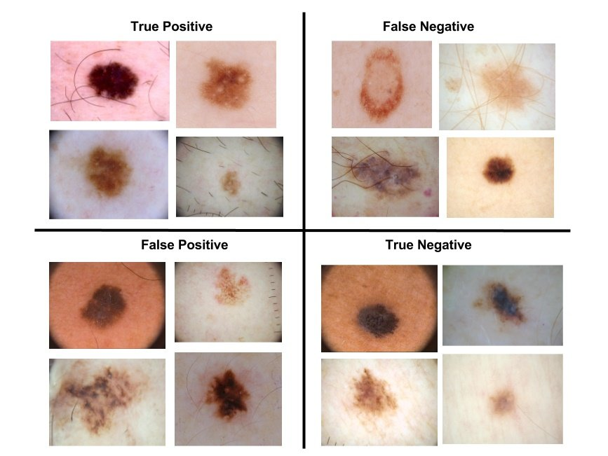
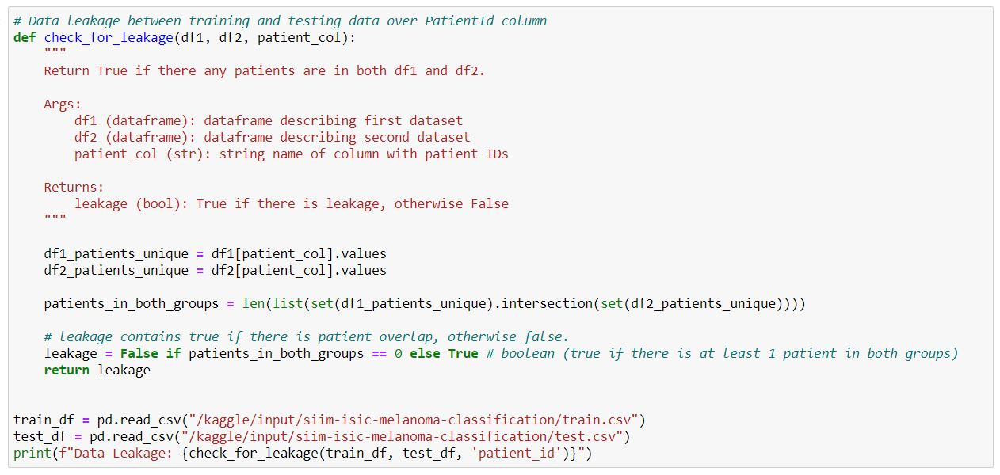
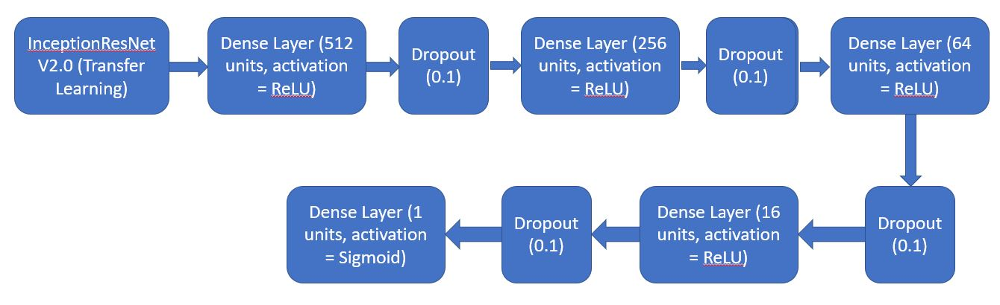
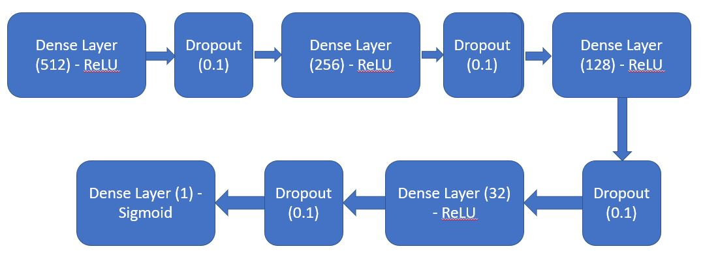

# Melanoma-Classification-using-InceptionResNet

Skin cancer is the most prevalent type of cancer. Melanoma, specifically, is responsible for 75% of skin cancer deaths, despite being the least common skin cancer. The American Cancer Society estimates over 100,000 new melanoma cases will be diagnosed in 2020. It's also expected that almost 7,000 people will die from the disease. As with other cancers, early and accurate detection—potentially aided by data science—can make treatment more effective.

Currently, dermatologists evaluate every one of a patient's moles to identify outlier lesions or “ugly ducklings” that are most likely to be melanoma. Existing AI approaches have not adequately considered this clinical frame of reference. Dermatologists could enhance their diagnostic accuracy if detection algorithms take into account “contextual” images within the same patient to determine which images represent a melanoma. If successful, classifiers would be more accurate and could better support dermatological clinic work.

As the leading healthcare organization for informatics in medical imaging, the Society for Imaging Informatics in Medicine (SIIM)'s mission is to advance medical imaging informatics through education, research, and innovation in a multi-disciplinary community. SIIM is joined by the International Skin Imaging Collaboration (ISIC), an international effort to improve melanoma diagnosis. The ISIC Archive contains the largest publicly available collection of quality-controlled dermoscopic images of skin lesions.

In this project, we’ll identify melanoma in images of skin lesions. In particular, we’ll use images within the same patient and determine which are likely to represent a melanoma. Using patient-level contextual information may help the development of image analysis tools, which could better support clinical dermatologists.

Melanoma is a deadly disease, but if caught early, most melanomas can be cured with minor surgery. Image analysis tools that automate the diagnosis of melanoma will improve dermatologists' diagnostic accuracy. Better detection of melanoma has the opportunity to positively impact millions of people.

## Dataset

Dataset can be downloaded from [Kaggle](https://www.kaggle.com/c/siim-isic-melanoma-classification/data) link either on local machine or on Google colab space. If you are coding on kaggle notebook then no need to download data. It can be used readily from kaggle servers.

## Steps

Following steps are executed for image data:

1. Check for Data Leakage between training and testing data over PatientId column

2. Instantiating the model in the strategy scope & create the model on the TPU using InceptionResNet V2.0 (Transfer Learning).

3. Over-sampling data

4. Processing input data (tfrecords) and performing data augmentation.

5. Training the model

6. Testing model on test dataset.

In addition to the above steps, we also train separate model for numerical (tabular) data. The steps involved for creating numerical data model are:

1. One-hot encoding of categorical data

2. Since, the data is present in different ranges, we scale the data to the same scale using Min-Max Scaler.

3. Replace NAs with 0.

4. Perform Over-sampling using SMOTE (Synthetics Minority Oversampling Technique).

5. Create a sequential model by defining series of Dense layers and dropouts.

6. Train the model and test it on test-data.

## Metrics and Algorithms used

1. BATCH_SIZE = 16 * tpu_strategy.num_replicas_in_sync
2. Image_Model Epochs = 16
3. IMG_HEIGHT = 1024
4. IMG_WIDTH = 1024
5. StepsPerEpoch = count_data_items(TRAINING_FILENAMES)//BATCH_SIZE
6. weight_for_0 = (1 / 32542)*(39161)/2.0 
7. weight_for_1 = (1 / 6619)*(39161)/2.0
8. metrics =  loss & auc
9. Numerical_Model EPOCHS = 400
